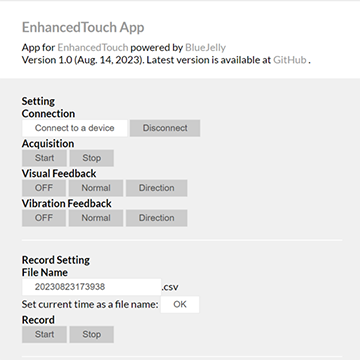

# EnhancedTouch App

## Overview
This is an app for [EnhancedTouch](http://ah.iit.tsukuba.ac.jp/research/enhancedtouch/) powered by [BlueJelly](https://github.com/electricbaka/bluejelly).

## Supported OS
- Windows10(version1706 or later)
- Mac(Requires OS X Yosemite or later)
- Android(Android 6.0 Marshmallow or later)
- Linux(Requires Kernel 3.19+ and BlueZ 5.41+ installed)
- Chrome OS

## Unsupported OS
- iOS

## Supported Browser
- Chrome only

## Demo
[Demo in Applied Haptics Laboratory](http://ah.iit.tsukuba.ac.jp/wp-content/uploads/EnhancedTouch/index.html)

## How to Use
### Before Use

#### Charge the EnhancedTouch device
- Turn off the device
  - The switch is 1 (outside: on, inside: off) 
- Plug the USB micro B to the USB port 2
  - While charging, the device illuminates in red
  - When charging is complete, it turns off   
#### Pairing (only initial use)
- Turn on the device
  - The device vibrates 
- Pair the device with your machine 
  - The method of pairing depends on the operating system you use
  - The device appears as ETXXX (XXX is the device ID)
#### Update Firmware (for technical collaborators)
- Turn on the device while pressing the button 3
  - The device does NOT vibrate
- Connect the device with your PC
  - PC recognize the device as an USB Flash memory
  - Delete the "firmware.bin"
  - Upload the new firmware
    - The EnhancedTouch project is available
      - [ET9: mbed OS2 (private)](https://github.com/Taku-Hachisu/ET9)
      - ET10: Arduino (under construction)
- Turn off the device
#### Wear the device

- Make sure that the electrodes 4 contact with your skin
  - Make the housing on the palm side of the wrist
  - You may wear a device on the other side of your wrist if it doesn’t have much hair
- Make USB port and switch facing to you
- Turn on the device
  - The device vibrates
  - If not, charge the device

### Use App

- Open the app
- Click "Connect to a device"
  - Select ETXXX on the window
- Click "Start" on Acquistion to monitor the event measured by the device
  - Click "Stop" to stop monitoring
- While acquisition is NOT active, you can control the mode of visual and vibration feedback by clicking "OFF", "Normal", or "Direction" on Visual/Vibration Feedback
- While acquision is active, you can record the event by clicking "Start" on Record
  - Clikc "Stop" to stop recording
  - Then, a record file (csv) will be automatically downloaded
  - You can change the file name as you want